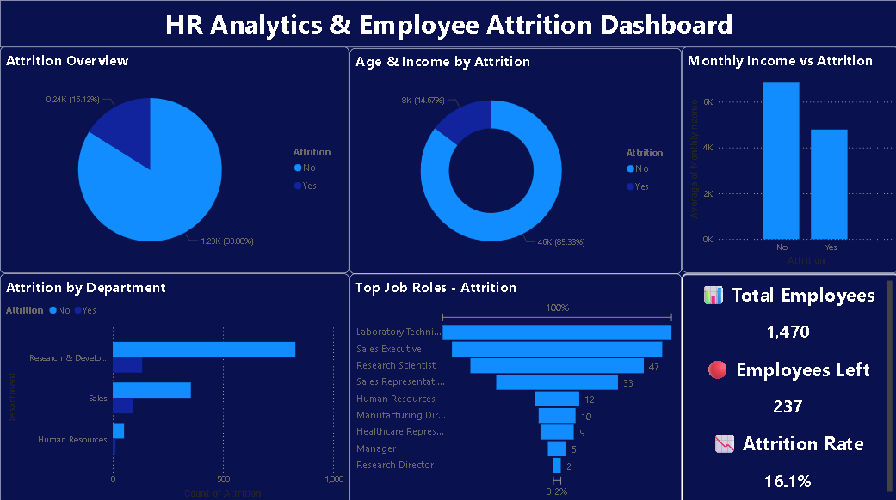

# HR Analytics & Employee Attrition Analysis

## Project Overview
Analyzed IBM HR Analytics dataset to understand why employees leave and built an ML model to predict attrition. This project covers complete data science pipeline from data cleaning to machine learning and interactive dashboard.

## Dataset
- Source: IBM HR Analytics Dataset (Kaggle)
- Records: 1,470 employees
- Features: 35 columns
- Target Variable: Attrition (Yes/No)

## Tools & Technologies
- Python, Pandas, NumPy, Matplotlib, Seaborn
- Scikit-Learn (Random Forest Classifier)
- SQL (SQLite)
- Power BI Desktop

## Key Findings
- Attrition Rate: 16.1% (237 out of 1,470 employees)
- Employees who left earned 30% less (₹4,787 vs ₹6,832)
- Younger employees (avg age 33.6) leave more than older ones (avg age 37.5)
- Sales department has highest attrition (92 employees left)
- Overtime employees are significantly more likely to leave
- Laboratory Technicians (62) and Sales Executives (57) left the most

## ML Model Results
- Model: Random Forest Classifier
- Accuracy: 88.1%
- Training Data: 1,176 employees
- Testing Data: 294 employees
- Top Factors: Monthly Income, Age, OverTime, Distance From Home

## Project Structure
HR-Analytics-Attrition-Analysis/
│
├── data/
│   └── WA_Fn-UseC_-HR-Employee-Attrition.csv
│
├── outputs/
│   ├── chart1_attrition_count.png
│   ├── chart2_attrition_by_department.png
│   ├── chart3_income_vs_attrition.png
│   ├── chart4_age_distribution.png
│   ├── chart5_jobsatisfaction_vs_attrition.png
│   ├── chart6_overtime_vs_attrition.png
│   ├── chart7_feature_importance.png
│   ├── hr_clean_data.csv
│   └── HR_Attrition_Dashboard_Screenshot.png
│
├── hr_analysis.py
├── hr_sql_analysis.py
├── HR_Attrition_Dashboard.pbix
└── README.md

## Dashboard Preview

## Author
**Mokshit Yadav**
BBA Finance | NDIM, GGSIPU
[LinkedIn](https://linkedin.com/in/mokshit-yadav)